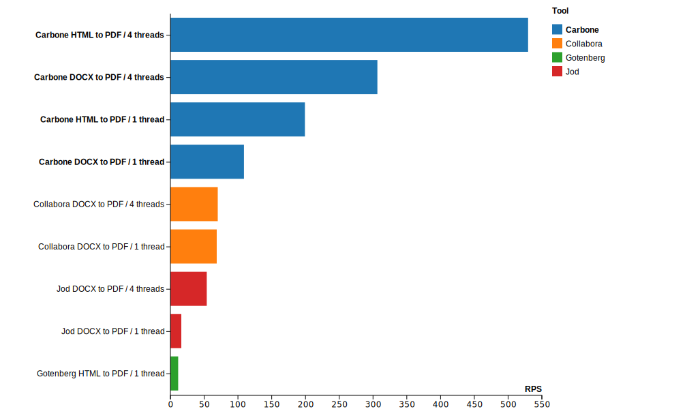

# 📊 Document Converter Performance Benchmark

> **Comprehensive performance comparison of popular free document conversion tools**

[](LICENSE)
[](https://k6.io)

A detailed performance benchmark comparing the most popular free and open-source document conversion solutions: **Carbone**, **Collabora**, **Jod-converter**, and **Gotenberg**. This repository provides real-world performance metrics, helping you choose the right tool for your document conversion needs.

---

## 🎯 Quick Results



### Performance Summary

| Tool              | Threads         | Conversion  | Avg Latency | Throughput (RPS) |
| ----------------- | --------------- | ----------- | ----------- | ---------------- |
| **Carbone**       | 4 (chrome)      | HTML → PDF  | 9.27ms      | 529.62           |
| **Carbone**       | 4 (libreoffice) | DOCX → PDF  | 16.15ms     | 306.47           |
| **Carbone**       | 1 (chrome)      | HTML → PDF  | 24.88ms     | 199.17           |
| **Carbone**       | 1 (libreoffice) | DOCX → PDF  | 45.70ms     | 108.91           |
| **Collabora**     | 4 (libreoffice) | DOCX → PDF  | 70.78ms     | 70.12            |
| **Collabora**     | 1 (libreoffice) | DOCX → PDF  | 72.34ms     | 68.59            |
| **Jod-converter** | 4 (libreoffice) | DOCX → PDF  | 92.58ms     | 53.84            |
| **Jod-converter** | 1 (libreoffice) | DOCX → PDF  | 305.41ms    | 16.15            |
| **Gotenberg**     | 1 (chrome)      | HTML → PDF  | 432.60ms    | 11.52            |

> 💡 **Key Finding**: Carbone consistently outperforms other solutions, especially with multi-threading enabled, achieving up to **529 RPS** for HTML to PDF conversions.

> ⚡ **Performance Note**: Carbone could potentially be even faster, as it performs additional parsing to detect Carbone tags within documents in addition to the conversion process. This means Carbone is doing more work (template parsing + conversion) while still achieving the best performance.

> **Gotenberg** does not support multi-threading.

## 📈 Key Insights

- ⚡ **Fastest Overall**: Carbone with 4 threads (9.27ms avg for HTML→PDF)
- 🚀 **Best Scalability**: Carbone shows significant performance gains with multi-threading
- 📄 **DOCX Conversion**: Carbone leads with 16.15ms (4 threads) vs 70.78ms (Collabora)
- 🌐 **HTML Conversion**: Carbone dominates with 9.27ms vs 432.60ms (Gotenberg)


## 🛠️ Tools Tested

| Tool | Version | Description |
|------|---------|-------------|
| [**Carbone Community Edition**](https://carbone.io) | 5.0.4 | Document generation/conversion engine |
| [**Collabora**](https://www.collaboraoffice.com) | Latest | LibreOffice-based document server |
| [**Jod-converter**](https://github.com/jodconverter/jodconverter) | Latest | Java-based document converter |
| [**Gotenberg**](https://gotenberg.dev) | 8.25.0 | Docker-powered document conversion API |

---

## 🚀 Getting Started

### Prerequisites

- [Docker](https://www.docker.com/get-started) installed and running
- [k6](https://k6.io) for load testing

### Install k6

```bash
# macOS
brew install k6

# Linux (not tested)
sudo gpg -k
sudo gpg --no-default-keyring --keyring /usr/share/keyrings/k6-archive-keyring.gpg --keyserver hkp://keyserver.ubuntu.com:80 --recv-keys C5AD17C747E3415A3642D57D77C6C491D6AC1D53
echo "deb [signed-by=/usr/share/keyrings/k6-archive-keyring.gpg] https://dl.k6.io/deb stable main" | sudo tee /etc/apt/sources.list.d/k6.list
sudo apt-get update
sudo apt-get install k6

# Windows
choco install k6
```

---

## 📋 Benchmarking Guide

### 🔴 JOD Converter

#### 1. Start JOD Converter

```bash
# Single thread
docker run --rm -p 8080:8080 \
  -v "$PWD/jod/application-1.properties:/etc/app/application.properties:ro" \
  ghcr.io/jodconverter/jodconverter-examples:rest

# Multi-thread (4 threads)
docker run --rm -p 8080:8080 \
  -v "$PWD/jod/application-4.properties:/etc/app/application.properties:ro" \
  ghcr.io/jodconverter/jodconverter-examples:rest
```

#### 2. Verify Conversion

```bash
curl -v \
  -F "data=@./sample.docx" \
  http://localhost:8080/lool/convert-to/pdf \
  --output outputJod.pdf
```

#### 3. Run Benchmark

```bash
k6 run jod-converter.js
```


### 🟠 Collabora Converter

#### 1. Start Collabora

```bash
# Single thread
docker run -d --name collabora --privileged -t \
  -p 127.0.0.1:9980:9980 \
  -e "extra_params=--o:ssl.enable=false --o:ssl.termination=true --o:per_document.max_concurrency=1 --o:num_prespawn_children=1" \
  collabora/code

# Fix systemplate warning
docker exec -u 0 collabora coolconfig update-system-template

# Multi-thread (4 threads)
docker run -d --name collabora --privileged -t \
  -p 127.0.0.1:9980:9980 \
  -e "extra_params=--o:ssl.enable=false --o:ssl.termination=true --o:per_document.max_concurrency=4 --o:num_prespawn_children=4" \
  collabora/code
```

> ⚠️ **Note**: `--privileged` flag is required to avoid `/usr/bin/coolmount: Operation not permitted` errors.

#### 2. Verify Conversion

```bash
curl -k \
  -F "data=@./sample.docx" \
  http://localhost:9980/cool/convert-to/pdf \
  --output outputCollabora.pdf
```

#### 3. Run Benchmark

```bash
k6 run collabora-converter.js
```


### 🟣 Carbone Converter

**Version**: 5.0.4

#### 1. Start Carbone

```bash
# Single thread
docker run -t -i --rm -p 4000:4000 \
  carbone/carbone-ee:full-5.0.4 webserver -s -f 1

# Multi-thread (4 threads)
docker run -t -i --rm -p 4000:4000 \
  carbone/carbone-ee:full-5.0.4 webserver -s -f 4
```

#### 2. Verify Conversion

**DOCX to PDF** (using LibreOffice):

```bash
base64_template=$(base64 < ./sample.docx | tr -d '\r\n')
curl -k \
  -H "Content-Type: application/json" \
  -d "{\"data\": {}, \"template\": \"data:application/vnd.openxmlformats-officedocument.wordprocessingml.document;base64,${base64_template}\", \"convertTo\": \"pdf\"}" \
  http://localhost:4000/render/template?download=true \
  --output outputCarbone.pdf
```

**HTML to PDF** (using Chrome):

```bash
base64_html=$(base64 < ./sample.html | tr -d '\r\n')
curl -k \
  -H "Content-Type: application/json" \
  -d "{\"data\": {}, \"converter\":\"C\", \"template\": \"data:text/html;base64,${base64_html}\", \"convertTo\": \"pdf\"}" \
  http://localhost:4000/render/template?download=true \
  --output outputCarboneHTML.pdf
```

#### 3. Run Benchmark

```bash
# DOCX to PDF conversion
k6 run carbone-converter.js

# HTML to PDF conversion
k6 run carbone-converter-html.js
```


### 🔵 Gotenberg Converter

**Version**: 8.25.0

> ⚠️ **Limitation**: Gotenberg does not support multi-threading configuration.

#### 1. Start Gotenberg

```bash
docker run --rm -p 4000:3000 \
  gotenberg/gotenberg:8 gotenberg
```

#### 2. Verify Conversion

```bash
curl -v \
  -X POST "http://localhost:4000/forms/chromium/convert/html" \
  -F "files=@./sample.html;filename=index.html" \
  -o outputGotenberg.pdf
```

#### 3. Run Benchmark

```bash
k6 run gotenberg-converter-html.js
```

---

## 📊 Benchmark Methodology

### Test Environment

**Hardware Specifications:**
- **Device**: MacBook Pro with M4 Max
- **CPU**: Apple M4 Max chip
- **Architecture**: ARM64 (Apple Silicon)
- **Container Runtime**: Docker Desktop

**Software Versions:**
- **Benchmark Date**: December 1st, 2025
- **Docker Images**: Latest available versions as of the benchmark date
  - Carbone Community Edition (Free Edition): `carbone/carbone-ee:full-5.0.4`
  - Collabora: `collabora/code`
  - Jod-converter: `ghcr.io/jodconverter/jodconverter-examples:rest`
  - Gotenberg: `gotenberg/gotenberg:8` (v8.25.0)

### Test Configuration

- **Load Testing Tool**: [k6](https://k6.io) by Grafana Labs
- **Test Duration**: 60 seconds per configuration
- **Virtual Users**: 5 concurrent users
- **Metrics Collected**:
  - Average latency (ms)
  - Requests per second (RPS)
  - 95th percentile latency
  - Error rates

> ⚠️ **Note**: All benchmarks were run using Docker containers on macOS. Performance may vary on different hardware configurations and operating systems.

For detailed results, see [RESULT.md](RESULT.md).


## 📝 Sample Files

This repository includes sample files for testing:

- `sample.docx` - Sample Word document
- `sample.html` - Sample HTML file


## 🤝 Contributing

Contributions are welcome! If you'd like to:

- Add more document converters to the benchmark
- Improve the testing methodology
- Fix issues or improve documentation

Please feel free to open an issue or submit a pull request.


## 📄 License

This project is licensed under the Apache License 2.0 - see the [LICENSE](LICENSE) file for details.


## 🙏 Acknowledgments

- [k6](https://k6.io) - Load testing tool
- All the open-source document converter projects tested


## ⭐ Star History

If you find this benchmark useful, please consider giving it a star! ⭐


**Made with ❤️ for the open-source community**
